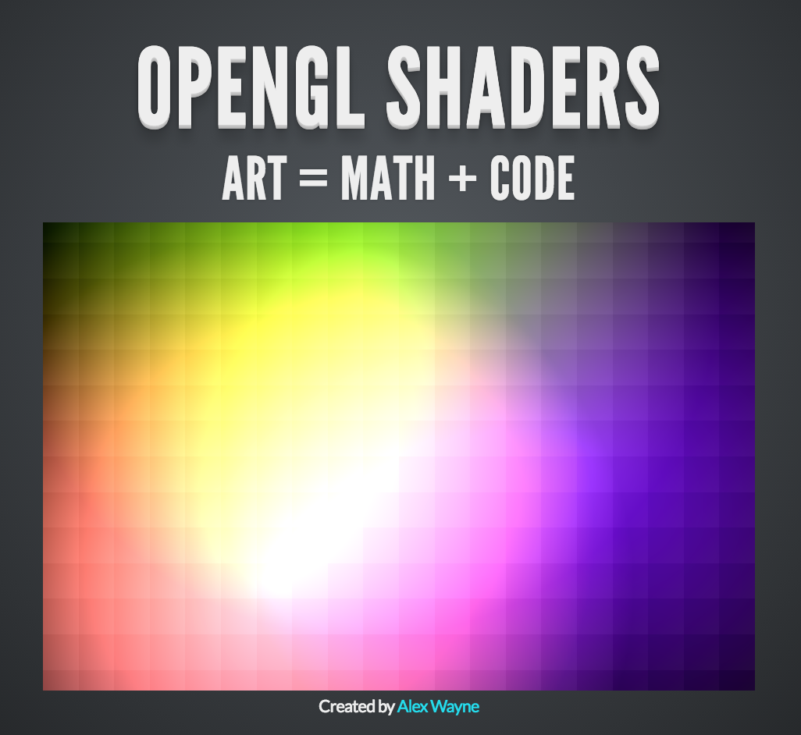

I presented at my local makerspace on shaders. I had recently discovered
them myself, and became fascinated by how they turn code and math into art.
But they also turn the the classic rendering paradigm that I knew of at the
time on its head: instead of rendering an object into pixels, you ask a
program what color this pixel right here is.

This presentation explains the basics of how it works and each example is
itself a live WebGL shader.

[
  View the slides
  
](http://alexjwayne.github.io/OpenGL-Shaders-Slides/#/)
