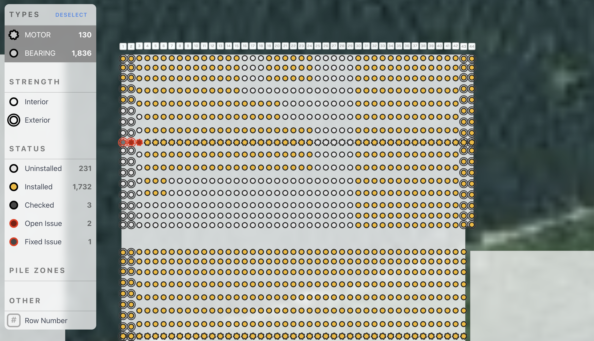

The work I do by day is for [SOLVEnergy](https://solvenergy.com).

We have developed a software platform that tracks the construction of utility scale solar power plants. Then we take them live and monitor, and report on, their performance.

Here's a map of installed components in a demo project.

I can't show too much since it's proprietary for our clients and internal use, but I can say, after working on for a number of years, it's pretty cool.

Some tech involved:

- [TypeScript](https://www.typescriptlang.org/)
- [Express.js](https://expressjs.com/)
- [React](https://react.dev/)
- [React Native](https://reactnative.dev/) via [Expo](https://expo.dev/)
- [tRPC](https://trpc.io/)
- [Prisma](https://www.prisma.io/)
- [WebGL](https://developer.mozilla.org/en-US/docs/Web/API/WebGL_API)
