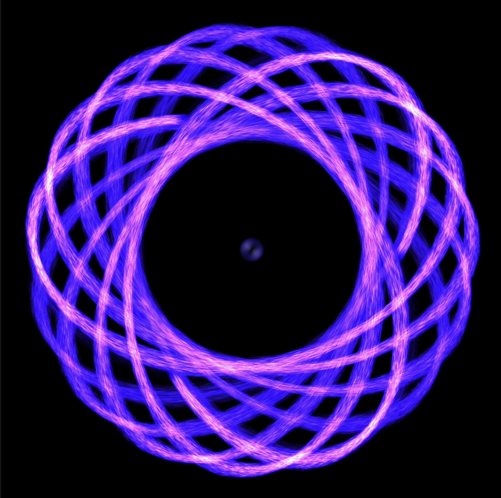

This was an experiment to learn [WebGPU](https://en.wikipedia.org/wiki/WebGPU) via [TypeGPU](https://docs.swmansion.com/TypeGPU/), and ECS via [bitECS](https://github.com/NateTheGreatt/bitECS).

- Uses a compute shader to simulate the particles so that particle updates and rendering can all happen on the GPU.
- Uses react to render the controls.
