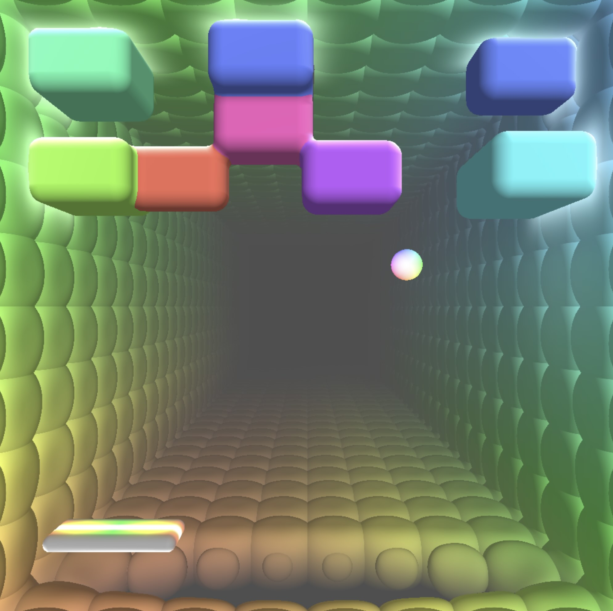

This is [WebGPU](https://en.wikipedia.org/wiki/WebGPU) experiment as a simple breakout style game. It's rendering is entirely done in a single shader with Raymarching and SDFs, and implemented with [TypeGPU](https://docs.swmansion.com/TypeGPU/).

