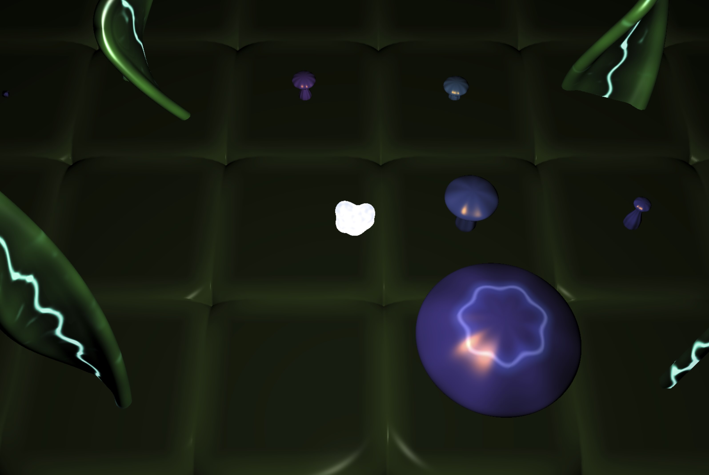

A generative art experiment. Use the arrow keys to explore the evergrowing garden.

Rendered entirely on the GPU with [WebGPU](https://en.wikipedia.org/wiki/WebGPU) and [TypeGPU](https://docs.swmansion.com/TypeGPU/). It uses SDFs and raymarching to render perfectly curved organic shapes.

